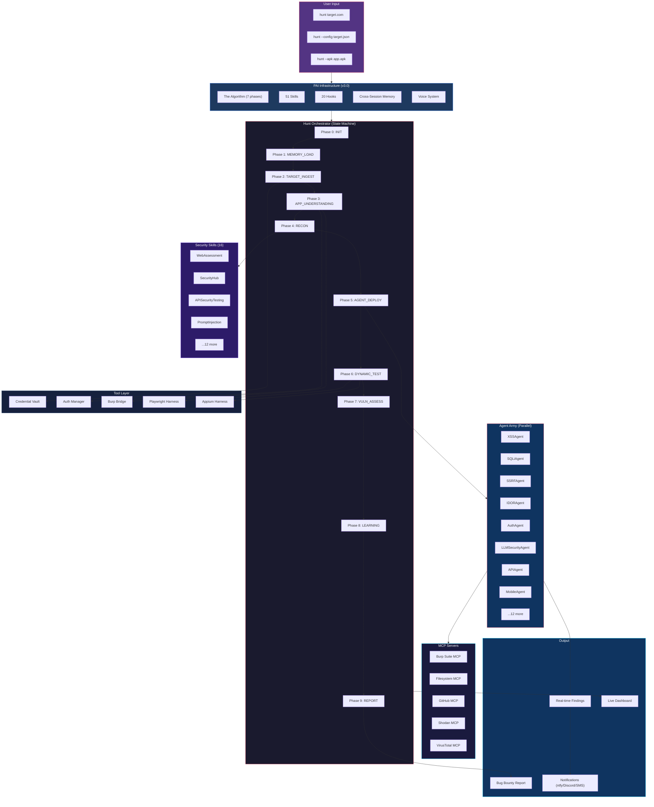

<!-- SOURCE: https://raw.githubusercontent.com/h4ckologic/bughunter-ai/HEAD/README.md | FETCHED: 2026-09-01 -->
<p align="center">
  
</p>

<h1 align="center">BugHunter AI</h1>

<p align="center">
  <strong>Autonomous Bug Bounty Hunting Framework Powered by Claude Code + PAI</strong>
</p>

<p align="center">
  <em>28 specialized AI agents. 8 orchestrated workflows. State-machine orchestration. 51 skills. Zero human input required.</em>
</p>

<p align="center">
  <a href="#quick-start">Quick Start</a> &bull;
  <a href="#full-setup-guide">Full Setup</a> &bull;
  <a href="#pai-superpowers">Superpowers</a> &bull;
  <a href="#architecture">Architecture</a> &bull;
  <a href="#agents">Agents</a> &bull;
  <a href="#sample-prompts">Prompts</a> &bull;
  <a href="#contributing">Contributing</a>
</p>

<p align="center">
  
  
  
  
  
  
  
</p>

---

## What is BugHunter AI?

BugHunter AI is an **autonomous bug bounty hunting framework** that turns [Claude Code](https://docs.anthropic.com/en/docs/claude-code) into an elite security researcher. Built on top of the **PAI (Personal AI Infrastructure)** system, it combines 20 specialized vulnerability agents, 51 skills, 13 expert AI agents, 20 lifecycle hooks, and a full offensive security toolchain into a single command:

```bash
# That's it. One command. Autonomous hunting.
hunt https://app.example.com
```

**What happens next:**
1. A state machine initializes and tracks 10 phases of the hunt
2. Credentials are loaded from an encrypted vault (never inline)
3. The app is profiled — flows mapped, tech stack fingerprinted, trust boundaries identified
4. Hypothesis-driven agents deploy in parallel — each with a specific attack theory
5. Findings are reported in real-time with CVSS scoring
6. A professional bug bounty report is generated automatically

---

## Why BugHunter AI?

| Manual Bug Bounty | BugHunter AI |
|---|---|
| Hours of recon before first payload | Autonomous recon → profiling → attack in minutes |
| Forget where you left off between sessions | State machine checkpoints every phase — `--resume` anytime |
| Credentials in plaintext notes | Encrypted vault with 1Password integration |
| Run same tools blindly on every target | Hypothesis-driven: agents attack WHERE the AppProfile says bugs live |
| Test one thing at a time | 5 agents run in parallel, findings shared in real-time |
| Miss AI/LLM vulnerabilities | Dedicated LLMSecurityAgent with OWASP LLM Top 10 |
| Medium findings silently dropped | Mediums archived for attack chain correlation |
| No memory between hunts | Cross-session learning — gets smarter with every engagement |
| Single tool / single domain | 51 skills covering web, mobile, API, cloud, network, binary, AI |

---

## The Full Stack: PAI + Superpowers + BugHunter

BugHunter AI is not just a skill — it's part of a **complete offensive security infrastructure**. Here's what you get when you install the full setup:

### PAI (Personal AI Infrastructure) v3.0

The foundation layer. PAI is a general problem-solving system that provides:

- **The Algorithm (v1.5.0)** — 7-phase structured reasoning (OBSERVE → THINK → PLAN → BUILD → EXECUTE → VERIFY → LEARN)
- **51 Skills** — Specialized capabilities from security to content creation
- **13 Expert Agents** — Architect, Engineer, Pentester, Researcher variants, QA Tester, and more
- **20 Lifecycle Hooks** — Automated security validation, session management, algorithm tracking
- **Cross-Session Memory** — Persistent learning across conversations
- **Voice System** — ElevenLabs TTS integration with custom AI personality
- **Multi-Channel Notifications** — ntfy, Discord, Twilio alerts for long tasks and findings

### Superpowers Plugin

Claude Code's official `superpowers` plugin adds enhanced capabilities:

- Extended tool access and MCP server integration
- Advanced agent orchestration with team mode
- Enhanced permission management

### Security Skill Stack (16 Skills)

| Skill | Coverage |
|-------|----------|
| **BugBountyFramework** | Autonomous 10-phase hunt orchestration |
| **WebAssessment** | OWASP WSTG v5, OWASP Top 10 |
| **SecurityHub** | Master security command center with intelligent skill routing |
| **OffensiveSecurityOrchestrator** | Kill chain tracking, adaptive methodology |
| **APISecurityTesting** | REST, GraphQL, gRPC, BOLA, BFLA, mass assignment |
| **MobileSecurity** | OWASP MASTG v2, Frida, Objection, MobSF |
| **NetworkSecurity** | AD attacks, BloodHound, Kerberoasting, pivoting |
| **CloudSecurity** | AWS/Azure/GCP, IAM escalation, Pacu, ScoutSuite |
| **ExploitDev** | Heap exploitation, ROP chains, safe-linking bypass |
| **ReverseEngineering** | Ghidra, radare2, binary analysis |
| **MalwareAnalysis** | Static/dynamic analysis, YARA, IOC extraction |
| **PromptInjection** | OWASP LLM Top 10, MITRE ATLAS |
| **VulnResearch** | CVE development, AFL++ fuzzing, CodeQL |
| **SASTOrchestration** | Semgrep, CodeQL, custom rules, taint tracking |
| **SCASecurity** | SBOM, supply chain, dependency confusion |
| **ThreatModeling** | STRIDE, PASTA, attack trees |
| **Recon** | Subdomain enum, asset discovery, Shodan |
| **RedTeam** | 32-agent adversarial analysis |

### Expert Agent Army (13 Agents)

| Agent | Specialty |
|-------|-----------|
| **Pentester** | Offensive security specialist — vulnerability assessment, exploitation |
| **Engineer** | Elite principal engineer — TDD, strategic planning |
| **Architect** | System design — constitutional principles, feature specs |
| **Algorithm** | PAI Algorithm expert — ISC creation and evolution |
| **Designer** | UX/UI specialist — Figma, shadcn/ui |
| **Artist** | Visual content — Flux, GPT-Image-1, prompt engineering |
| **QATester** | Browser-automation validation — Gate 4 completion gates |
| **Intern** | 176-IQ generalist — multi-faceted problem solving |
| **ClaudeResearcher** | Multi-query academic research via Claude WebSearch |
| **CodexResearcher** | Technical archaeology — O3, GPT-5-Codex consultation |
| **GeminiResearcher** | Multi-perspective research via Google Gemini |
| **GrokResearcher** | Contrarian analysis via xAI Grok |
| **PerplexityResearcher** | Investigative journalism via Perplexity |

### MCP Servers (3 Core + 5 Recommended)

**Core (Pre-configured):**
| Server | Purpose |
|--------|---------|
| **Burp Suite MCP** | Proxy traffic analysis, scope sync, Collaborator, HAR export |
| **Filesystem MCP** | Direct file system access |
| **GitHub MCP** | Repository operations, PR management |

**Recommended Security MCPs:**
| Server | Purpose | Install |
|--------|---------|---------|
| **Shodan** | Internet asset search | `npm install -g @shodan/mcp-server` |
| **VirusTotal** | Malware/IOC analysis | `npx -y @virustotal/mcp-server` |
| **CVE/NVD** | Vulnerability database | Custom Python server |
| **Nuclei** | Vulnerability scanning | Custom Node server |
| **GitHub Security Advisory** | CVE tracking | Via GitHub MCP |

### Plugins (4 Active)

| Plugin | Purpose |
|--------|---------|
| **superpowers** | Enhanced Claude Code capabilities |
| **claude-mem** | Persistent cross-session memory |
| **swift-lsp** | Swift language server protocol |
| **ui-ux-pro-max** | Advanced UI/UX design capabilities |

### Lifecycle Hooks (20 Hooks)

| Hook | Trigger | Purpose |
|------|---------|---------|
| **SecurityValidator** | Pre: Bash, Edit, Write, Read | Validates all tool calls for security |
| **VoiceGate** | Pre: Bash | Voice notification gate |
| **AgentExecutionGuard** | Pre: Task | Guards agent execution |
| **SkillGuard** | Pre: Skill | Validates skill invocations |
| **SetQuestionTab** | Pre: AskUserQuestion | Terminal tab management |
| **AlgorithmTracker** | Post: Bash, Task* | Tracks algorithm phase progression |
| **QuestionAnswered** | Post: AskUserQuestion | Tracks Q&A flow |
| **WorkCompletionLearning** | SessionEnd | Captures learnings from work |
| **SessionSummary** | SessionEnd | Generates session summaries |
| **RelationshipMemory** | SessionEnd | Builds relationship context |
| **UpdateCounts** | SessionEnd | Updates system statistics |
| **IntegrityCheck** | SessionEnd | Validates system integrity |
| **RatingCapture** | UserPromptSubmit | Captures quality ratings |
| **AutoWorkCreation** | UserPromptSubmit | Auto-creates work tracking |
| **UpdateTabTitle** | UserPromptSubmit | Dynamic terminal tab titles |
| **SessionAutoName** | UserPromptSubmit | Auto-names sessions |
| **StartupGreeting** | SessionStart | Displays PAI banner |
| **LoadContext** | SessionStart | Loads session context |
| **CheckVersion** | SessionStart | Version checks |
| **StopOrchestrator** | Stop | Clean shutdown handling |

---

## Architecture



---

## Quick Start

For the minimal BugHunter-only install:

```bash
git clone https://github.com/h4ckologic/bughunter-ai.git
cd bughunter-ai
./install.sh
```

For the **full setup with PAI, Superpowers, and all security skills**, see the [Full Setup Guide](SETUP.md).

---

## Full Setup Guide

See **[SETUP.md](SETUP.md)** for the complete, step-by-step guide to replicate the full infrastructure:

1. Install prerequisites (Claude Code, Bun, Go tools, Burp Suite)
2. Install PAI v3.0 (the foundation)
3. Configure your identity (DA + Principal)
4. Install plugins (Superpowers, claude-mem, ui-ux-pro-max)
5. Configure MCP servers (Burp, Filesystem, GitHub)
6. Install BugHunter AI skill
7. Set up optional security MCPs (Shodan, VirusTotal, NVD)
8. Configure notifications (ntfy, Discord, Twilio)
9. Verify the installation

---

## Hunt Modes

| Mode | CVSS Threshold | Finding Target | Best For |
|------|----------------|----------------|----------|
| `bounty` (default) | >= 8.0 | 10 | Bug bounty programs — only critical/high findings |
| `pentest` | >= 4.0 | 20 | Penetration tests — comprehensive coverage |
| `comprehensive` | >= 0.0 | 50 | Full security audits — everything documented |

```bash
hunt https://target.com                       # bounty mode (default)
hunt https://target.com --mode pentest        # pentest mode
hunt https://target.com --mode comprehensive  # comprehensive mode
```

---

## Agents

BugHunter deploys **20 specialized agents**, each an expert in one vulnerability class:

| Agent | Focus | Key Techniques |
|-------|-------|----------------|
| **AppReviewAgent** | Application understanding | Flow mapping, tech fingerprinting, trust boundary analysis |
| **LLMSecurityAgent** | AI/LLM vulnerabilities | OWASP LLM Top 10, prompt injection, RAG poisoning |
| **XSSAgent** | Cross-site scripting | Reflected, stored, DOM-based, mutation XSS |
| **SQLiAgent** | SQL injection | Union, blind, time-based, second-order SQLi |
| **SSRFAgent** | Server-side request forgery | Cloud metadata, internal services, protocol smuggling |
| **IDORAgent** | Insecure direct object refs | Horizontal/vertical privilege escalation, UUID prediction |
| **AuthAgent** | Authentication bypass | JWT attacks, session fixation, OAuth flaws, MFA bypass |
| **APIAgent** | API security | BOLA, mass assignment, rate limiting, GraphQL introspection |
| **CORSAgent** | CORS misconfiguration | Origin reflection, null origin, wildcard subdomains |
| **FileUploadAgent** | File upload attacks | Content-type bypass, polyglot files, path traversal |
| **XXEAgent** | XML external entities | Blind XXE, OOB data exfiltration, SSRF via XXE |
| **RCEAgent** | Remote code execution | Command injection, SSTI, deserialization, SSRF→RCE |
| **BusinessLogicAgent** | Business logic flaws | Race conditions, price manipulation, workflow bypass |
| **MobileAgent** | Android/iOS security | SSL pinning bypass, exported components, insecure storage |
| **WindowsAgent** | Windows/AD attacks | Kerberoasting, NTLM relay, privilege escalation |
| **ReconAgent** | Reconnaissance | Subdomain enum, port scanning, tech fingerprinting |
| **ReverseEngineeringAgent** | Binary analysis | Static analysis, dynamic analysis, vulnerability identification |
| **ExploitDevAgent** | Exploit development | PoC creation, payload crafting, reliability testing |
| **DesktopAppAgent** | Desktop app security | Electron, .NET, Java app testing |
| **GraphQLAgent** | GraphQL security | Introspection, batch abuse, nested DoS, relay IDOR, subscription hijack |
| **WebSocketAgent** | WebSocket security | CSWSH, message injection, origin bypass, auth hijacking |
| **CSRFAgent** | CSRF exploitation | Token/SameSite/Referer bypass, content-type tricks, CORS+CSRF chains |
| **CachePoisoningAgent** | Web cache poisoning | Unkeyed header injection, cache deception, CDN-specific bypasses |
| **HTTPSmugglingAgent** | HTTP request smuggling | CL.TE, TE.CL, H2.CL desync, response queue poisoning |
| **SubdomainTakeoverAgent** | Subdomain takeover | Dangling DNS, cloud service fingerprinting, cookie/CSP impact |
| **RaceConditionAgent** | Race conditions | HTTP/2 single-packet attack, limit bypass, double-spend, TOCTOU |
| **PrototypePollutionAgent** | Prototype pollution | Client-side PP→XSS gadgets, server-side PP→RCE, AST injection |
| **LLMAgent** | Legacy LLM testing | Basic prompt testing (superseded by LLMSecurityAgent) |

### How Agents Work

Agents don't blindly scan. They receive **specific hypotheses** from the AppProfile:

```
Traditional scanning:          BugHunter AI:
"Run sqlmap on all URLs"   →   "The /api/v1/reports?filter= parameter
                                is passed into a PostgreSQL ORDER BY
                                clause — test time-based blind SQLi HERE"
```

This means **90% less noise** and **10x faster confirmation**.

---

## Orchestrator Workflows

The hunt orchestrator classifies your target and dispatches the appropriate workflow. Each workflow defines its own phases, agent dispatch order, parallelism, and gate conditions.

| Workflow | Trigger | Phases | Agents | Lines |
|----------|---------|--------|--------|-------|
| **W_HUNT_WEB** | Web application URL | 10 | 21 agents (parallel) | 2,018 |
| **W_HUNT_API** | API endpoint / Swagger / GraphQL | 9 | 10 agents | 487 |
| **W_HUNT_LLM** | AI/LLM app (chatbot, RAG, copilot) | 13 | 8 agents | 688 |
| **W_HUNT_MOBILE** | APK / IPA file | 10 | 7 agents | 1,037 |
| **W_HUNT_NETWORK** | IP range / CIDR / AD target | 9 | 5 agents | 814 |
| **W_HUNT_CLOUD** | AWS / Azure / GCP environment | 10 | 5 agents | 607 |
| **W_HUNT_THICK_CLIENT** | Electron / .NET / Java desktop app | 10 | 6 agents | 874 |
| **W_RECON** | Standalone recon request | 10 | 2 agents | 703 |

### How Workflows Work

```
hunt https://target.com
  │
  ├── Orchestrator classifies target type
  ├── Loads W_HUNT_WEB workflow
  ├── Phase 1: RECON (ReconAgent + SubdomainTakeoverAgent)
  ├── Phase 2: APP PROFILING (AppReviewAgent via dev-browser)
  ├── Phase 3: AUTH TESTING (AuthAgent)
  ├── Phase 4: INJECTION (SQLi + XSS + XXE + RCE — PARALLEL)
  ├── Phase 5: ACCESS CONTROL (IDOR + CORS + CSRF — PARALLEL)
  ├── Phase 6: BUSINESS LOGIC (BusinessLogic + RaceCondition — PARALLEL)
  ├── Phase 7: ADVANCED (SSRF + CachePoisoning + HTTPSmuggling + PrototypePollution — PARALLEL)
  ├── Phase 8: API/PROTOCOL (GraphQL + WebSocket + API — PARALLEL, conditional)
  ├── Phase 9: FILE HANDLING (FileUploadAgent, conditional)
  └── Phase 10: REPORTING (aggregate, score, deduplicate, generate report)
```

Each phase has **gate conditions** — the workflow only advances when the gate criteria are met. Agents within a phase run in parallel for maximum speed.

---

## Tool Chain

| Tool | File | Purpose |
|------|------|---------|
| **Hunt Orchestrator** | `Tools/hunt-orchestrator.ts` | State machine — phase tracking, checkpointing, resume, dashboard |
| **Credential Vault** | `Tools/credential-vault.ts` | Encrypted credential storage, 1Password, env vars, auto-redact |
| **Auth Manager** | `Tools/auth-manager.ts` | B2C/OAuth/SAML automation, session persistence, health checks |
| **Burp Bridge** | `Tools/burp-bridge.ts` | Burp Suite REST API bridge — scope sync, HAR export, Collaborator |
| **Browser Harness** | `Tools/playwright-harness.ts` | Browser automation via dev-browser CLI (primary) / Playwright CLI (fallback) |
| **Appium Harness** | `Tools/appium-harness.ts` | Mobile app testing — Android/iOS through proxy |

---

## Sample Prompts

### Your First Hunt

```
hunt https://app.example.com
```

### Hunt with Stored Credentials

```
Store credentials for example-corp: username admin@test.com, password SecureP@ss123

hunt https://app.example.com --creds vault:example-corp
```

### Pentest Mode (Find More)

```
hunt https://staging.example.com --mode pentest
```

### Hunt an AI Application

```
hunt https://ai-chatbot.example.com --mode pentest

Focus on AI-specific vulnerabilities:
- Extract the system prompt
- Test cross-user data access
- Try prompt injection (direct and indirect)
- Test RAG poisoning via document upload
```

### Resume a Hunt

```
hunt https://app.example.com --resume
```

### Full Power Hunt

```
hunt https://app.example.com using username test@example.com and password TestPass123

Use all available tools, skills, workflows, and MCPs.
Use Playwright and Burp MCPs to perform dynamic analysis.
Map the entire application attack surface.
Understand the application before attacking.
Find 10 high-severity vulnerabilities.
Don't stop until done.
```

### Use Security Skills Directly

```
# Run a web assessment using the WebAssessment skill
/WebAssessment https://target.com

# Use the SecurityHub for guided methodology
/SecurityHub start assessment on https://target.com

# Run OSINT reconnaissance
/Recon https://target.com --deep

# Test LLM/AI security
/PromptInjection https://ai-app.com
```

See [examples/sample-prompts.md](examples/sample-prompts.md) for more.

---

## Live Dashboard

Check hunt progress anytime:

```
hunt https://target.com --status
```

```
======================================================================
  HUNT STATUS: https://app.example.com
  Mode: BOUNTY | Elapsed: 45m | Findings: 3
  Min CVSS: 8.0 | Target: 10 findings
======================================================================
  [OK] INIT                  2s
  [OK] MEMORY_LOAD           1s
  [OK] TARGET_INGEST         3s
  [OK] APP_UNDERSTANDING     120s     (2 findings)
  [>>] RECON                 running...
  [  ] AGENT_DEPLOY
  [  ] DYNAMIC_TEST
  [  ] VULN_ASSESS
  [  ] LEARNING
  [  ] REPORT

  FINDINGS:
    F-001 [critical] SSRF: Webhook URL fetches AWS metadata
    F-002 [high] IDOR: Access other users' expense reports
    F-003 [high] XSS: Stored XSS in admin notification panel
======================================================================
```

---

## Directory Structure

```
# BugHunter AI Skill (installed to ~/.claude/skills/)
~/.claude/skills/BugBountyFramework/
├── SKILL.md                     # Main skill definition (v2.0)
├── Agents/                      # 20 specialized vulnerability agents
│   ├── AppReviewAgent.md
│   ├── LLMSecurityAgent.md
│   ├── XSSAgent.md
│   ├── SQLiAgent.md
│   ├── SSRFAgent.md
│   ├── IDORAgent.md
│   ├── AuthAgent.md
│   ├── APIAgent.md
│   ├── CORSAgent.md
│   ├── FileUploadAgent.md
│   ├── XXEAgent.md
│   ├── RCEAgent.md
│   ├── BusinessLogicAgent.md
│   ├── MobileAgent.md
│   ├── WindowsAgent.md
│   ├── ReconAgent.md
│   ├── ReverseEngineeringAgent.md
│   ├── ExploitDevAgent.md
│   ├── DesktopAppAgent.md
│   └── LLMAgent.md
├── Tools/                       # TypeScript tools (Bun runtime)
│   ├── hunt-orchestrator.ts
│   ├── credential-vault.ts
│   ├── auth-manager.ts
│   ├── burp-bridge.ts
│   ├── playwright-harness.ts
│   └── appium-harness.ts
├── Templates/
│   ├── BugReport.md
│   └── TargetConfig.md
└── Wordlists/

# PAI Infrastructure (the foundation)
~/.claude/
├── settings.json                # Central config (identity, hooks, permissions, plugins)
├── CLAUDE.md                    # Entry point
├── .mcp.json                    # MCP server configuration
├── skills/                      # 51 skills
│   ├── PAI/                     # Core PAI system
│   ├── BugBountyFramework/      # This project
│   ├── WebAssessment/           # OWASP WSTG v5
│   ├── SecurityHub/             # Security command center
│   ├── OffensiveSecurityOrchestrator/
│   ├── APISecurityTesting/
│   ├── MobileSecurity/
│   ├── NetworkSecurity/
│   ├── CloudSecurity/
│   ├── ExploitDev/
│   ├── ReverseEngineering/
│   ├── MalwareAnalysis/
│   ├── PromptInjection/
│   ├── VulnResearch/
│   ├── SASTOrchestration/
│   ├── SCASecurity/
│   ├── ThreatModeling/
│   ├── Recon/
│   ├── RedTeam/
│   ├── OSINT/
│   ├── Research/                # Multi-engine research
│   ├── Browser/                 # Browser automation
│   ├── Fabric/                  # 240+ prompt patterns
│   └── ...35 more
├── agents/                      # 13 expert agent definitions
│   ├── Pentester.md
│   ├── Engineer.md
│   ├── Architect.md
│   └── ...10 more
├── hooks/                       # 20 lifecycle hooks
│   ├── SecurityValidator.hook.ts
│   ├── AlgorithmTracker.hook.ts
│   ├── LoadContext.hook.ts
│   ├── handlers/                # 7 hook handlers
│   └── lib/                     # 12 shared libraries
├── mcps/                        # Custom MCP servers
│   └── burp-mcp/
├── VoiceServer/                 # ElevenLabs TTS integration
└── MEMORY/                      # Persistent memory system
    ├── BugBounty/
    │   ├── Sessions/
    │   ├── Findings/
    │   ├── PatternDB/
    │   ├── LearningLogs/
    │   ├── TargetProfiles/
    │   └── Vault/
    ├── LEARNING/
    ├── SECURITY/
    ├── STATE/
    ├── WORK/
    └── VOICE/
```

---

## How It Differs from Other Tools

| Feature | BugHunter AI | Nuclei/Burp Scanner | Manual Testing |
|---------|-------------|---------------------|----------------|
| **Intelligence** | Understands the app first, then attacks | Signature matching | Human expertise |
| **Context** | Remembers across sessions | Stateless | Notes/memory |
| **Hypothesis-driven** | Tests specific theories | Tests everything | Depends on researcher |
| **AI/LLM testing** | First-class OWASP LLM Top 10 | Not supported | Rare expertise |
| **Parallel agents** | 5 specialized agents simultaneously | Single scanner | One person |
| **State machine** | Checkpoints, resume, never loses progress | Run from scratch | Bookmarks/notes |
| **Credential security** | Encrypted vault + 1Password | Config files | Plaintext notes |
| **Multi-domain** | Web + Mobile + API + Cloud + Network + Binary | Single domain | Limited scope |
| **Algorithm** | 7-phase structured reasoning (PAI) | None | Informal methodology |
| **Skills ecosystem** | 51 skills, 16 security-focused | Plugin-based | Tool-dependent |

---

## Responsible Use

This framework is designed for **authorized security testing only**:

- Only test applications you have **written permission** to test
- Bug bounty programs with **clearly defined scope**
- Penetration tests with **signed engagement letters**
- Your own applications in **staging/development environments**

**BugHunter AI enforces scope:** The framework includes hard scope enforcement that blocks testing out-of-scope targets. Configure your scope before hunting.

The maintainers are not responsible for misuse. Always follow your program's rules of engagement.

---

## Contributing

We welcome contributions! See [CONTRIBUTING.md](CONTRIBUTING.md) for guidelines.

**Ideas for contributions:**
- New specialized agents (e.g., GraphQLAgent, WebSocketAgent)
- Additional auth strategy templates
- Better wordlists
- Integration with more MCP servers
- New security skills
- Improved report templates
- Bug fixes and documentation

---

## License

MIT License. See [LICENSE](LICENSE) for details.

---

## Acknowledgements

- **[Anthropic](https://anthropic.com)** — Claude Code, the AI engine behind everything
- **[Daniel Miessler / PAI](https://github.com/danielmiessler/PAI)** — Personal AI Infrastructure v3.0 — the foundation layer providing the Algorithm (v1.5.0), 51 skills, 13 expert agents, 20 lifecycle hooks, cross-session memory, and the structured reasoning framework that makes autonomous hunting possible
- **[Claude Code Superpowers](https://github.com/anthropics/claude-code)** — Official Claude Code plugin enabling enhanced tool access, advanced agent orchestration with team mode, and extended MCP server integration that powers parallel agent deployment
- **[claude-mem](https://github.com/thedotmack/claude-mem)** — Persistent cross-session memory plugin that enables BugHunter's learning system to remember techniques, patterns, and findings across hunts
- **[PortSwigger](https://portswigger.net)** — Burp Suite integration via custom MCP bridge
- **[ProjectDiscovery](https://projectdiscovery.io)** — Nuclei, httpx, subfinder, naabu — the recon backbone
- **[Playwright](https://playwright.dev)** — Browser automation for dynamic testing and app profiling
- **[Bun](https://bun.sh)** — TypeScript runtime powering all tools and hooks
- **[ElevenLabs](https://elevenlabs.io)** — Voice synthesis for the PAI notification and voice system
- **[ntfy](https://ntfy.sh)** — Push notifications for long-running hunts

---

<p align="center">
  <strong>Built with Claude Code + PAI by <a href="https://github.com/h4ckologic">h4ckologic</a></strong>
</p>

<p align="center">
  <em>If BugHunter AI helps you find bugs, give it a star!</em>
</p>
