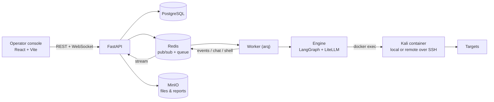

<!-- SOURCE: https://raw.githubusercontent.com/martian56/redcell/HEAD/docs/ARCHITECTURE.md | FETCHED: 2026-09-01 -->
# Architecture

REDCELL runs a team of LLM agents through a penetration test. The operator watches
and steers from a web console; the actual tools run inside a Kali container.

## The pieces

- **`apps/web`** — the React operator console. Talks to the API through one typed
  client (`packages/api-client`) that has a mock backend (demo, no server) and an
  HTTP backend. Live data (activity feed, terminals, the agent's browser) streams
  over WebSockets; the rest refreshes on a short poll.
- **`apps/api`** — FastAPI. REST routers, WebSocket fan-out, cookie/JWT auth. It
  does **not** run agents: it queues a run and relays worker output to the browser.
- **`apps/worker`** — an `arq` worker. Consumes jobs from Redis and executes them:
  `run_engagement`, `resume_running` (checkpoint recovery on restart),
  `operate_shell`, `generate_report`.
- **`packages/core/redcell_core`** — the shared library:
  - `engine/` — the agent loop (`runner.py`, a LangGraph plan/act loop over an
    orchestrator and executor agents), the structured tools (`nmap`, `webscan`,
    `msf`), execution backends (`execution.py`: local Docker / remote Docker over
    SSH / sim), the browser driver, pivoting, reporting, and the scope guardrail
    (`scope.py`).
  - `models/`, `repositories/` — async SQLAlchemy models and data access.
  - `bus.py` — Redis pub/sub (with an in-process fallback) for events, chat, shell
    I/O, and run control.
  - `storage.py` — S3/MinIO for uploads, loot, and reports.
  - `config.py`, `security.py`, `logs.py`, `steer.py`.

## How a run flows

1. The operator creates a session (scope, targets, ROE, an engagement brief, and
   optional assessment files) and a run. The API persists it and enqueues
   `run_engagement`.
2. The worker's `LiveRunner` loads the run, starts the execution backend (a Kali
   container), stages any assessment files into it, and runs the orchestrator loop.
3. The orchestrator plans and delegates objectives to executor agents, which run
   tools (scoped and shell-quoted) inside the container and record findings, loot,
   and hosts. Every tool command is cancellable.
4. Output streams to Redis; the API relays it to the console over WebSockets. The
   operator can steer the live run through chat, or stop it.
5. Every step checkpoints (SQLite), so a crash or restart resumes via
   `resume_running`.

## Cross-process coordination

- **Events / chat / shell** — Redis pub/sub channels (`bus.py`), relayed to the
  browser by the API's WebSocket routes.
- **Run control** — the API publishes `pause`/`resume`/`stop`/`interrupt` on a
  control channel; the worker's control watcher cancels in-flight work.
- **Steer queue** — operator directives the orchestrator drains at each plan step.
- **Checkpoints** — a SQLite store so runs survive restarts.
